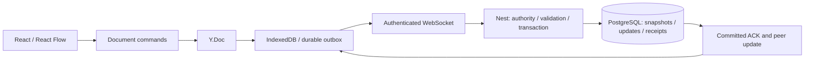

# Archboard

Archboard is a local-first architecture diagram editor for explaining software systems
and keeping diagrams alongside other projects. It also implements authenticated
collaboration, offline recovery, checkpoints and presentation workflows.

Start with `/demo` to explore without signing in or running a database. Export JSON
regularly to a private project folder: browser storage can be cleared or evicted.

## Explore the project

- Component, code, schema and note cards, connections and boundaries.
- Web application, Event processing and Service boundary templates.
- Inspector editing, keyboard controls, local undo and fresh-ID restoration.
- Presentation steps, immutable server checkpoints and restore-as-new copies.
- Portable JSON and controlled SVG/PNG exports.
- Server boards with owner/editor/viewer access, discussion and invitations.
- Account-scoped local persistence and a durable offline update outbox.

These are implemented capabilities. Integrated browser/database verification remains
partly deferred. No hosted demo, performance guarantee or production-ready release
is claimed; see the [evidence index](docs/evidence/phase8/README.md).

## Run and use it

Use **Node 22.23.2** and **pnpm 11.24.0**, then install the committed dependency graph:

```text
pnpm install --frozen-lockfile
```

[Setup](docs/setup.md) covers the database-free demo, authenticated development,
GitHub OAuth, explicit migrations and optional production configuration.
[Using Archboard](docs/using-archboard.md) explains saving, recovery, exports,
checkpoints, templates and keyboard controls.

The [portfolio walkthrough](docs/portfolio-walkthrough.md) provides a five-minute
script and engineering notes. Add real screenshots or recordings after exercising
the corresponding workflow.

## Engineering

React Flow owns canvas interaction and rendering. Yjs supplies document merging.
Archboard adds graph contracts, domain commands, current permissions, isolated
validation, commit-before-ACK ordering, retained retry receipts, local outbox/recovery
rules and portable diagram/presentation workflows.



This shows the durable graph path. HTTP APIs separately own accounts, metadata,
memberships, invitations, comments and checkpoints. Zustand holds transient UI
state rather than another editable graph.

```text
apps/web                 React/Vite editor and browser adapters
apps/api                 NestJS/Express HTTP and collaboration server
packages/contracts       graph, API and protocol schemas
packages/document-model  Yjs validation and domain commands
packages/export          portable JSON and controlled SVG
packages/fixtures        examples and templates
packages/sync-client     persistence, outbox and synchronization
```

The optional production package uses one Nest writer behind same-origin Caddy and
PostgreSQL. [Operations](docs/phase-8-operations.md) documents secrets, health,
shutdown and upgrades. P8-08 daily backup/restore automation is unfinished and
deferred for the current personal/portfolio scope.

## Checks and status

```text
pnpm format:check
pnpm lint
pnpm typecheck
pnpm boundary:check
pnpm build
```

Production builds need suitable HTTPS/WSS configuration; see setup. These checks
do not prove browser, database or hosted behavior. `pnpm test` launches browsers;
`pnpm test:integration` connects to a database. Both remain paused under the
[verification policy](docs/verification-policy.md). Inspect aggregate children,
including commands labelled `non-browser`, before running them.

Phase 8 is closed for the user's personal/portfolio scope, with P8-01–P8-07,
P8-09 and a scoped P8-13 handoff delivered. P8-08 and P8-10–P8-12, plus full
production release reconciliation, remain deferred. The original Version 1 gate
stays OPEN. [The closure amendment](docs/phase-8-closure.md), [Phase 8](phase8.md),
[its guide](guide7.md) and the [evidence index](docs/evidence/phase8/README.md)
retain the original release plan. Historical [Phase 7](docs/phase-7-presentation-portability.md)
and earlier audits describe their recorded builds, not current acceptance.
